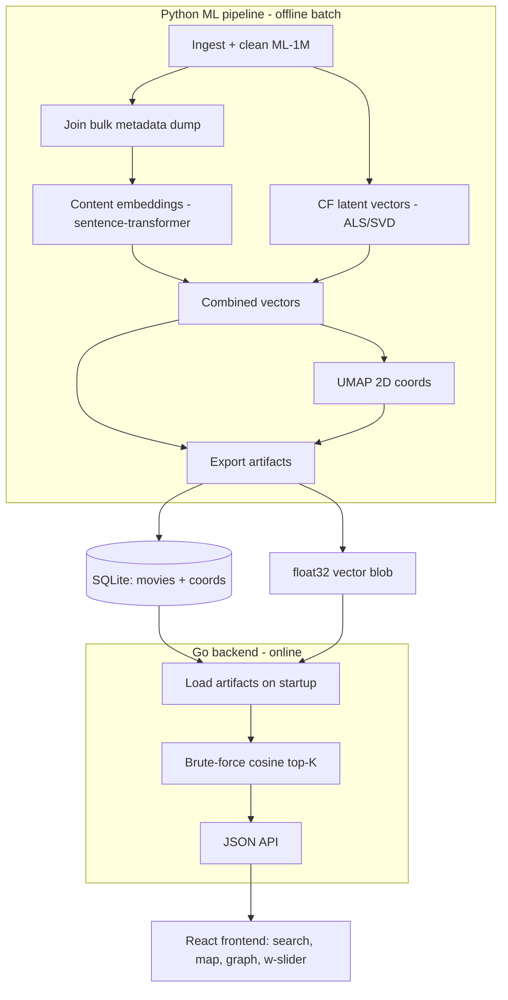

# Movie Map

A hybrid movie-similarity engine. Given a query movie, return a ranked list of similar movies (each with a similarity score) and two visualizations: a global 2D "map" where similar movies cluster, and a per-query neighbor graph.

Data source: MovieLens 1M in [ml-1m/](ml-1m/) (`movies.dat`, `ratings.dat`, `users.dat`, `README`). ~3,883 movies, ~1,000,209 ratings, 6,040 users, all pre-2000.

## Locked decisions (from planning)

- Similarity is hybrid: `score = w * CF_sim + (1 - w) * content_sim` for dataset movies; content-only for modern movies (no ratings exist for them). `w` is exposed as a UI slider.
- Content model: sentence-transformer embeddings over `overview + genres + keywords + cast`.
- Collaborative filtering: matrix factorization (ALS / truncated SVD) on the ratings matrix, with a min-ratings threshold and shrinkage.
- Global map: UMAP to 2D over the combined vectors.
- Storage: SQLite for metadata + a flat `float32` binary file for vectors.
- Backend: Go loads artifacts and does brute-force cosine top-K (parallelized with goroutines). No ANN library in v1.
- Frontend: React with autocomplete search, a WebGL scatter map, a force-directed neighbor graph, and the `w` slider.
- Modern-movie metadata comes from a one-time bulk metadata dump (e.g. the Kaggle "The Movies Dataset" / TMDB metadata export) that already contains `overview`, `genres`, `keywords`, `cast`, and `imdb_id`/`tmdb_id`. No live API. Wikipedia scraping is a fallback for gaps.

## Architecture

## Similarity model

Each movie gets a combined vector: `[ normalize(content_vec) | scale * cf_vec ]`. Modern movies have no `cf_vec`, so that block is zero-imputed (they cluster by content only).

- In-dataset vs in-dataset: `w * cos(cf_a, cf_b) + (1 - w) * cos(content_a, content_b)`.
- Modern query vs dataset: `cos(content_a, content_b)` only.
- The Go backend applies `w` live at query time so the slider works without recomputation.

## Repository layout (proposed)

- `ml/` - Python pipeline
  - `ingest.py` - parse + clean `ml-1m/*.dat`, join bulk dump
  - `content.py` - build text blobs, compute sentence-transformer embeddings
  - `collab.py` - build ratings matrix, factorize, produce CF vectors
  - `combine.py` - assemble combined vectors, UMAP coords
  - `export.py` - write SQLite + `vectors.f32`
  - `requirements.txt`
- `backend/` - Go service (`cmd/server`, handlers, cosine search, artifact loader)
- `frontend/` - React app (search, scatter map, neighbor graph, w-slider)
- `data/` - generated artifacts (`movies.db`, `vectors.f32`) - gitignored
- `plans.md` - this plan

## Data hygiene (ML-1M is messy)

- Files are Latin-1 (ISO-8859-1), not UTF-8 - decode accordingly or titles corrupt.
- Title format `"Matrix, The (1999)"` / `"American in Paris, An (1951)"` - un-invert the article and split the year into its own column.
- MovieIDs go up to 3952 but only ~3,883 exist; drop test/duplicate/junk entries.
- Sparse movies (few ratings) give noisy CF - apply a min-ratings threshold + shrinkage.
- Modern-movie join key: normalized title + year; dedupe against ML-1M to avoid collisions.

## Go API (v1)

- `GET /movies/search?q=` - title autocomplete.
- `GET /movies/{id}/similar?k=&w=` - ranked neighbors + scores, blended live by `w`.
- `GET /map` - all `(x, y)` points plus genre/cluster for coloring.
- `GET /graph/{id}?k=` - nodes + weighted edges for the query neighborhood.

# v1 - Working end-to-end system

Goal: prove the whole stack and ship a usable demo. Built in three phases so there is always something runnable.

## Phase 1 - ML-1M only, end-to-end

- Python: ingest + clean ML-1M, content embeddings from `title + genres` (coarse, expected), CF from ratings, combined vectors, UMAP coords, export to SQLite + `vectors.f32`.
- Go: load artifacts, cosine top-K, all four endpoints.
- React: search box, scatter map, neighbor graph, `w` slider.
- Outcome: query any dataset movie, see ranked neighbors + both visualizations. CF carries most of the signal at this stage.

## Phase 2 - Modern movies via bulk dump

- Download the bulk metadata dump once; join to ML-1M on `imdb_id`/`tmdb_id` and title+year.
- Rebuild content embeddings over the richer blob (`overview + genres + keywords + cast`) so thematic matches (e.g. party-teen comedies) actually cluster.
- Add 2000+ movies as content-only entries so modern queries like Project X or Superbad resolve to sensible dataset neighbors.
- Wikipedia fallback scraper for titles the dump misses.

## Phase 3 - Polish

- `w` slider re-queries and animates neighbor shifts between taste-based and content-based.
- Genre/cluster coloring on the map, poster thumbnails, hover cards.
- Parallelize the Go cosine scan with goroutines; add a simple benchmark.
- Basic offline sanity checks on neighbor quality.

### Completed: zoomable hierarchical map

- Obsidian-style wheel/pinch zoom, drag panning, double-click focus, selection
  centering, viewport culling, and fit controls.
- Deterministic three-level clustering with broad genre regions and niche
  genre-combination child regions.
- Zoom-based detail: broad labels when zoomed out, child labels and local
  similarity edges at medium zoom, and important movie titles close up.
- Precomputed local edges stored in SQLite so the browser does not construct a
  full all-to-all graph.
- Phase 2 descriptions can replace genre-combination labels with semantic
  themes without changing the frontend or API contract.

# v2 - Iteration and hardening

Improvements once v1 works, roughly in priority order.

## Recommendation quality

- Multi-movie input: accept a set of movies, use their centroid (or a re-ranking blend) as the query - directly matches the original "movies I give the map" idea.
- Better CF: implicit-feedback / BPR or a small neural CF model; time-aware weighting so recent ratings count more.
- Diversity + re-ranking (MMR) so results are not near-duplicates.
- Explainability: "similar because both are raunchy teen comedies / share cast X / co-liked by the same users."

## Richer signals

- Larger / better embedding models; optional poster-image embeddings (CLIP) for a multimodal blend.
- Use `users.dat` demographics for optional personalization (e.g. age/occupation-aware neighbors).

## Scale and freshness

- Replace brute-force with an ANN index (FAISS / HNSW) once the catalog grows.
- Optional live enrichment path: embed an unknown modern title on demand via a small Python inference service (the previously-discussed microservice boundary), keeping precompute as the default.
- Incremental artifact rebuilds instead of full recompute.

## Product and ops

- Save lists / user accounts; feedback loop to auto-tune `w`.
- Evaluation harness: precision@k / recall@k on held-out ratings; track quality across changes.
- Dockerize Python pipeline + Go backend + React; CI and a deploy target.

## Open items to confirm before/into v2

- Exact bulk dump to standardize on and its license terms for redistribution of derived artifacts.
- Whether v2 personalization should key off `users.dat` or a new user model.
